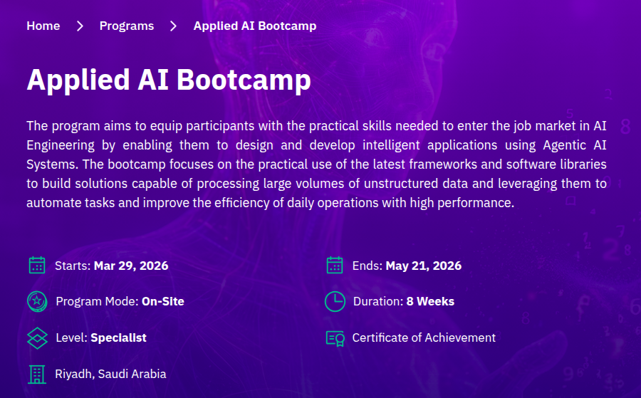

[{fig-align="center"}](https://athkax.sdaia.gov.sa/programs/a0a75987-ce88-4477-8c72-55b645a89987).

## Schedule

::: {.incremental}

- **Course 1: Python**  
    Build strong Python programming foundations to apply and integrate ML/DL/AI in software systems.
- **Course 2: Applied Data Science**  
    Calculate, analyze, visualize, interpret data and test hypothesis using Data Science.
- **Course 3: Applied Machine Learning**  
    Build reliable predictive modeling pipelines, debug its issues, evaluate and compare alternatives.
- **Course 4: Applied Deep Learning**  
    Use DL solution frameworks / libraries to apply AI to specific problems in vision and language.
- **Course 5: Agentic AI**  
    Develop, debug, evaluate deploy, and monitor LLM-driven AI Agents to automate tasks involving unstructured data.
- **Course 6: Agentic Engineering**  
    Use today's best practices to accelerate software development in your codebase.
- **Capstone Project**  
    Build agentic AI solutions to solve problems special to AI; utilizing skills learned in the bootcamp.

:::

## Policy: Attendance

The fourth absence will result in explusion from the bootcamp:

- Being late counts as 1/4 absence
- Leaving class frequently will result in 1 absence
- Execused absences must be proved by hospital

## Pedagogy

You will do most of the work.

{fig-align="center"}

## Learning Components

1. Slides
2. Lecture Notes
3. Labs
4. Exercises (Knowledge and Skill)

## 1. Lecture Notes

- The detailed learning material in written format.
- Spend enough focused reading time to read them to completion.
- **When?**: Read before (and after) class

## 2. Slides

- Facilitate instructors' lesson delivery.
- Press `S` to open up Speaker Notes for more details.
- **When?**: listten-in carefully to instructor during class.

## 3. Labs

- Live documents of worked-out examples
- "What if?" ask yourself, modify parts of the code cells and re-run them to verify understanding.
- **When?**: to be done during class, **after lecture**.

## 4. Exercises

- Assignments with increasing level of difficulty
- Some will test knowledge. Others will test skills
- You are expected to finish them in class, and before the next day
- **When?**: to be done during class, **after lecture and labs**.

## Submit your Work

You want to prove that you were the one who learned, not the AI.

Thus, we want to compile a proof-of-work; a commit history on your GitHub repo.

Open the repo [HassanAlgoz/python](https://github.com/HassanAlgoz/python/tree/main) then:

1. Fork it from the GitHub website
2. Clone it using VS Code locally
3. Create a `student/` folder in which you will include:
    - A `student/README.md` file with your full name in there
    - **Labs** you worked with during class
    - **Exercises** you were assigned during classs

## Commits

First, `git add` and `git commit` the lab/exercise before solving it.

Then, **for each question** in the exericse, you shall commit with three things:

1. week number
2. module number (if any)
3. exercise number
4. question number

Example: `w1 m1 ex1 q2`

## Push

Work must be pushed before the deadline assigned for that exercise.

## Learning and Desirable Difficulty

Your brain wants comfort; but as we all know- No pain. No gain. This is true for learning as it is true for exercising.

- No one is perfect. Fear of mistakes is a psychological barrier to growth and exceeding your limits.
- Make as much mistakes as you can; to get as much feedback as you can while you are in class.
- Get feedback and check your assumptions and understanding; before you "move on".
- Getting help from others is good; but be sure *YOU* get it.

## Policy: Getting Help from AI

- Relying on AI to solve your issues is **provably destructive to your learning**.
- Making mistakes is totally fine, but **cheating will result in banning from the bootcamp** without the possibility of return. This will be taken very seriously and no exceptions will be given whatsoever.
- We have sophisticated ways of detection.
- Instructors are here to help you; don't be afraid to ask questions you feel are "stupid" because there is no such thing.

## Bad Students

1. Let AI handle everything
2. Use someone else's work
3. Skip reading, labs, or exercises
4. Unaware of required work to be done
5. Don't commit as per the instructions

## Good Students

1. You pay attention to instructions and ask when things aren't clear
2. You are honest and consistent in putting in the required effort
3. You make lots programming trial and errors to gain skills

## Evaluations

Throughout the week, you will be asked to be in a **one-to-one interview** (max 10 questions). You should be able to:

1. express the ideas accurately in your own words (memorization + understanding)
2. answer matching the level of detail required by the question (stay within topic)
3. know when to say "I don't know" (awareness of knowledge/skill gaps)

Questions will be related to the learning material (both **knowledge and skills**) that have been covered thus far.

- Mostly from this week
- some from last week
- and few from previous weeks

If you score less than full, you'll have a second chance next week to correct based, on previous weeks' material again.
